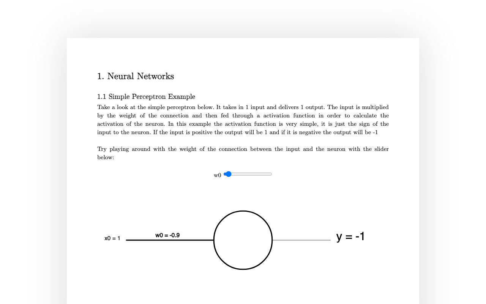

# 🧠 LR_V1

An interactive p5.js visualization of a single-neuron network, with sliders to tweak input weights and watch the output change live.



## Features

- 🎚️ **Live weight sliders** — drag a slider per input connection and see the neuron's output recompute in real time
- 🔗 **Visual network graph** — inputs, a neuron, and an output are drawn and connected on an HTML canvas via p5.js
- 🧮 **Feedforward math exposed** — the network's `feedforward()` and `activate()` calls are visible right in `sketch.js`, useful as a teaching aid

## Installation

```bash
git clone <this repo>
cd LR_V1
npm install
```

## Usage

```bash
npm run dev
```

Then open the printed local URL (default Vite port, typically [http://localhost:5173](http://localhost:5173)).

## Built with

- [p5.js](https://p5js.org/)
- [Vite](https://vitejs.dev/)

## Status

🧪 Small teaching/experiment sketch — single-neuron demo only, no persistence or multi-layer network support.

✅ Runs cleanly — `npm install && npm run build` verified working as of 2026-09-03 (harmless Vite warning about `sketch.js` needing a `type="module"` attribute, build still succeeds).
